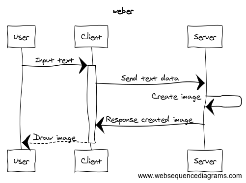

# weber
DSLで書かれたスキーマ定義をER図に変換するWEBツール

## アーキテクチャ
### フロント
  * ES6 or TypeScript
  * React or Angular

### サーバ
  * 言語
    * Ruby
    * Go
    * Java
    * Node.js
    * Python
  * 環境
    * GCP
    * AWS
    * Azure


## 機能
### 必須
  * DSLエディタ
  * ER図描画
    - リアルタイムにレンダリングさせる
  * ER図ダウンロード(png)
  * DSLのテキストファイルダウンロード

### 追加機能
  * ユーザ認証
    - メール、パスワード
    - OpenID Connect
    - Google
    - Facebook
    - Twitter
    - Github  
    \# OpenID Connect使おう(Firebase authenticateとかも使ってみたい)
  * ER図保存、ロード機能
  * ER図画像の保存先クラウドサービス連携
    - Google Driveに保存
    - Dropboxに保存
    - OneBoxに保存
  * DSL変換APIの外部展開
    - AppEngine内では画像変換まではできないので、dot言語に変換するまでが限界
    - API形式じゃなく、ライブラリとして提供でもいいかもしれない


## 処理フロー
  


## 調査すること
  * 図形描画はどうするか
  * DSLの仕様
  * DSLの構文解析方法
  * dot言語へのコンパイル方法

### 図形描画ライブラリ
  * [viz.js](http://viz-js.com/)
    * クライアント側でdot言語から画像を生成する
    * これ使っとこう
  * 自分でDSL定義するか、YAMLなどの既存のマークダウン言語を使うか

### DSL定義
  * 自前で定義する
  * YAMLなどの既存のマークアップ言語を使う

  \# YAMLでの記述した場合のイメージ

  ```yaml
  title: Company Data
  schemas:
    - company:
        relation:
          - to: employee
            type: one_to_many
        parameters
          - name: company_id
            type: integer
            primary_key: true
            forign_key: true
          - name: company_name
            type: string
    
    - employee:
        relation:
          - to: company
            type: many_to_one
        parameters:
          - name: employee_id
           primary_key: true
           forign_key: true
          - name: employee_name
            type: string
  ```


## その他
* 一定時間入力がない場合にイベントを発生させるサンプルコード  
  [参考](http://hakoniwahaniwa.hatenablog.com/entry/2013/10/13/205443)

  ```javascript
  var $area = document.querySelector("#sample-area")
  var stack = []

  $area.addEventListener("keyup", function() {
    stack.push(1)
    setTimeout(function() {
      stack.pop()
      if (stack.length === 0) {
        console.log("BANG!!")
      }
    }, 1000)
  })
  ```
