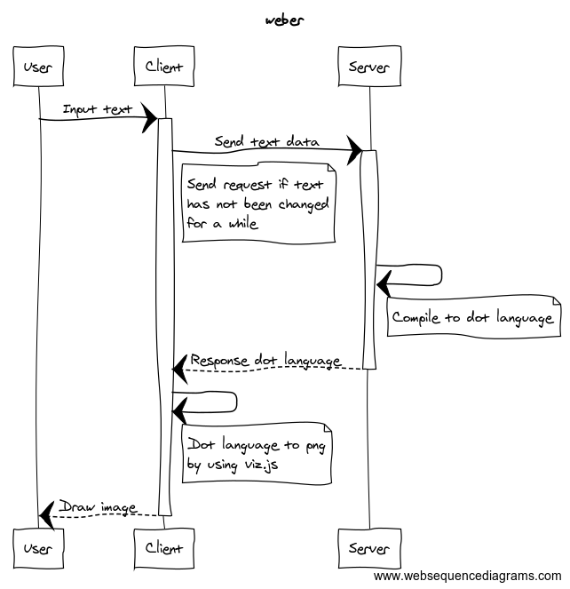

# weber
YAMLで書かれたスキーマ定義をER図に変換するWEBツール

## アーキテクチャ
### フロント
* ES6
* React or Angular

### サーバ
* Golang
* GAE/Go


## DLSイメージ
```yaml
title: Company Data
schemas:
  - company:
      relation:
        - to: employee
          type: one_to_many
      parameters
        - name: company_id
          type: integer
          primary_key: true
          forign_key: true
        - name: company_name
          type: string
  
  - employee:
      relation:
        - to: company
          type: many_to_one
      parameters:
        - name: employee_id
         primary_key: true
         forign_key: true
        - name: employee_name
          type: string
```


## 機能
* YAMLエディタ
* ER図描画
* ER図ダウンロード(png)
* YAMLダウンロード(いらないかも)


## 処理フロー



## 調査すること
### 図形描画ライブラリ
* [draw2d](https://github.com/llgcode/draw2d)
  * 矢印などはライブラリの機能で描画できそうだけど、ER図でよく見る鳥の足は無理そう
    - 鳥の足の部分は、画像を使用して見る？
* AppEngineで画像の生成ができるのか
